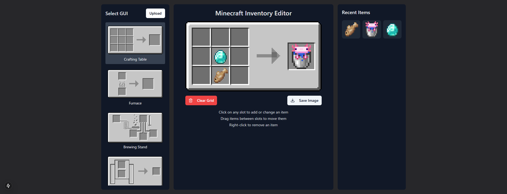

# Minecraft Inventory Editor

A web application for editing Minecraft inventories. Features GUI selection, item placement, and saving capabilities.

[](https://minecraft-inventory.s7a.dev)

## Features

- Multiple GUI type selection (Chest, Inventory, etc.)
- Drag and drop item placement
- Item search functionality
- Recently used items display
- Automatic image resizing
- Animated texture support

## Development Setup

```bash
# Clone the repository
git clone https://github.com/sya-ri/minecraft-inventory.git
cd minecraft-inventory

# Install dependencies
npm install

# Start development server
npm run dev
```

## Acknowledgments

Special thanks to:
- [v0.dev](https://v0.dev/) - For providing the initial UI design and components
- [Cursor](https://cursor.sh/) - For the excellent development environment and AI assistance
- [@YOHEMAL](https://github.com/YOHEMAL) - For creating and providing the Minecraft inventory GUI images

## License

This project is licensed under the MIT License - see the [LICENSE](./LICENSE) file for details. 