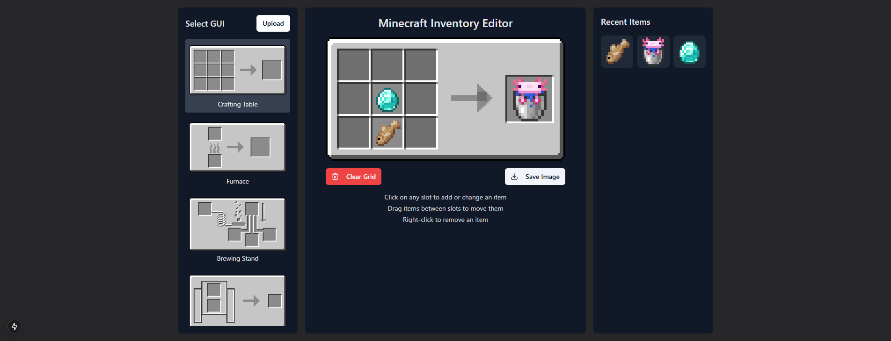

# Minecraft Inventory Editor

A web application for editing Minecraft inventories. Features GUI selection, item placement, and saving capabilities.

[](https://minecraft-inventory.s7a.dev)

## Features

- Multiple GUI type selection (Chest, Inventory, etc.)
- Drag and drop item placement
- Item search functionality
- Recently used items display
- Automatic image resizing
- Java 26.3: all 1,658 item IDs, including blocks and special models
- Local resource packs (ZIP or folder), ordered layers and saved settings
- Item appearance settings: colors, patterns, trims, CustomModelData and glint
- Shared atlas for browsing, placement and PNG export

## Development Setup

```bash
# Clone the repository
git clone https://github.com/sya-ri/minecraft-inventory.git
cd minecraft-inventory

# Install dependencies
npm install

# Start development server
npm run dev
```

## Generating Minecraft Assets

Generation is pinned to the official Java **26.3** client and its 1,658-entry item registry. Install Playwright Chromium once, then generate:

```bash
npx playwright install chromium
npm run generate
```

The TypeScript / Three.js renderer runs in headless Chromium, creates 128px images in `.cache/rendered`, then packs them at their original resolution into one lossless full-color PNG atlas. Enlarged block previews retain their rendered edge and texture detail; compression preserves the colors without palette reduction or dithering. Generation checks every registry ID and fails with an ID/reason report if any item cannot render. Only a fully successful run publishes the hashed atlas, compressed asset bundle and catalog. Java is not required for generation.

Normal browsing and PNG export use only `public/items.json` and its shared atlas. Vanilla source assets are downloaded as one hashed ZIP only when resource packs or appearance settings need rendering, then cached in IndexedDB. Packs and custom renders stay in the browser; there is no rendering or upload API.

See [resource pack usage, rendering boundaries and asset provenance](docs/resource-packs.md).

## Validation

```bash
npm run typecheck
npm run check
npm test
npm run test:rendering
npm run build
```

For browser integration checks, start `npm run dev -- --port 3100` in a separate terminal, then run `npm run test:browser`. Set `TEST_URL` to test another running instance. The test covers atlas-only requests, PNG export, local ZIP/folder imports, priority, failed-import recovery and persistence.

## Acknowledgments

Special thanks to:
- [v0.dev](https://v0.dev/) - For providing the initial UI design and components
- [Cursor](https://cursor.sh/) - For the excellent development environment and AI assistance
- [@YOHEMAL](https://github.com/YOHEMAL) - For creating and providing the Minecraft inventory GUI images
- Mojang - For the official Minecraft assets; Minecraft assets retain their original ownership and are not covered by this project's MIT license

## License

This project is licensed under the MIT License - see the [LICENSE](./LICENSE) file for details.
